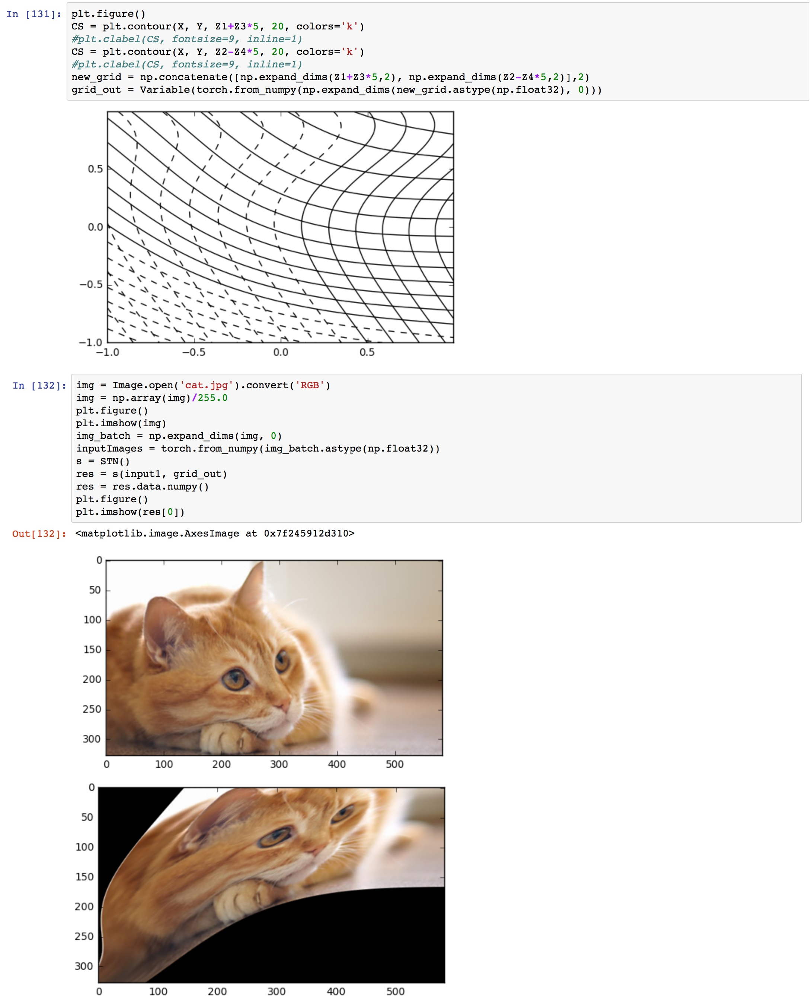

# PyTorch version of spatial transformer network

Ported from https://github.com/qassemoquab/stnbhwd according to pytorch tutorial. Now support CPU and GPU. To use the ffi you need to install the `cffi` package from pip.

# Build and test

```
cd script
./make.sh #build cuda code, don't forget to modify -arch argument for your GPU computational capacity version
python build.py
python test.py
```

There is a demo in `test_stn.ipynb`

# Modules

`STN` is the spatial transformer module, it takes a `B*H*W*D` tensor and a `B*H*W*2` grid normalized to [-1,1] as an input and do bilinear sampling.

`AffineGridGen` takes a `B*2*3` matrix and generate an affine transformation grid. 

`CylinderGridGen` takes a `B*1` theta vector and generate a transformation grid to remap equirectangular images along x axis. 

`DenseAffineGridGen` takes a `B*H*W*6` tensor and do affine transformation for each pixel. Example of convolutional spatial transformer can be found in `test_conv_stn.ipynb`.

An example of the landscape of the loss function of a simple STN with L1 Loss can be found in the demo.      

# Train hacks
- set a learning rate multiplier, 1e-3 or 1e-4 would work fine. 
- add an auxiliary loss to regularized the difference of the affine transformation from identity mapping, to aviod sampling outside the original image. 

# Complex grid demo
STN is able to handle a complex grid, however, how to parameterize the grid is a problem.


